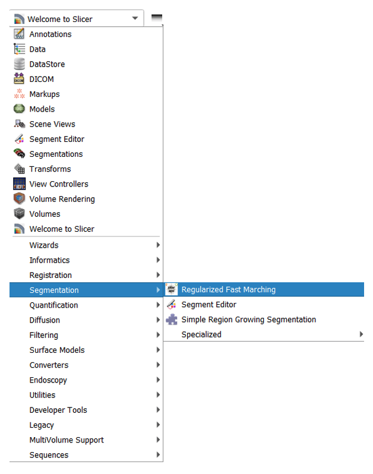
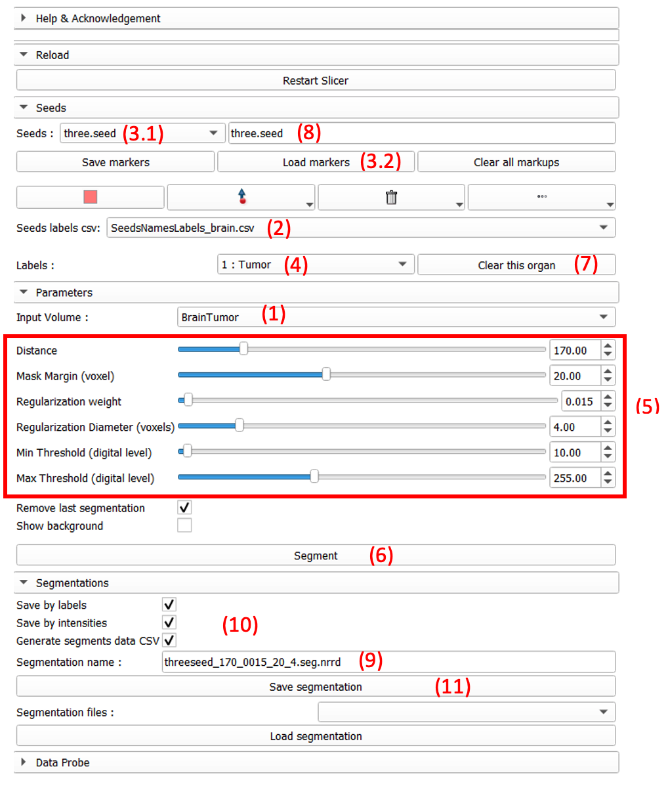
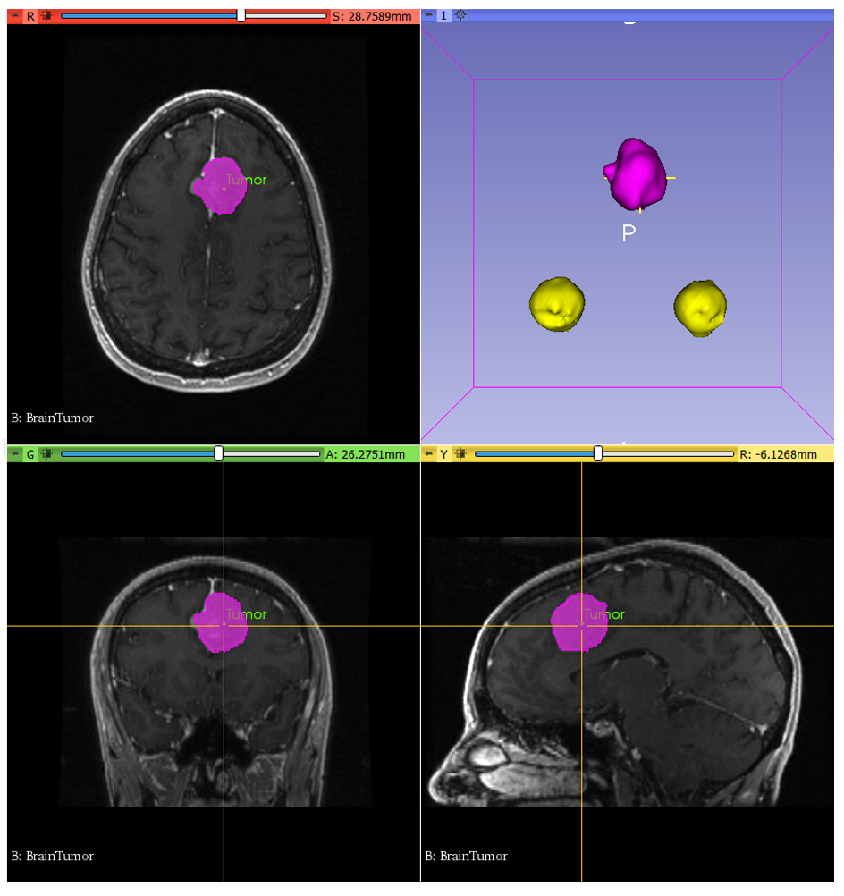
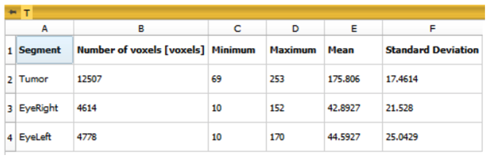

# **SlicerRegularizedFastMarching (SlicerRFM)**

## Module description

SlicerRegularizedFastMarching (Slicer RFM) is a Python module for 3DSlicer dedicated to the semi-interactive segmentation of 3D medical images. In order to perform the segmentation of one or several organs of interest, the user first clicks on the location of different markups in the 3D image volume using the 3DSlicer interface. The segmentation is then performed based on a fast-marching algorithm. Following the methodology of [1], a regularization term is calculated at the first segmentation run to limit as much as possible the crossing of narrow bridges between irrelevant neighboring anatomical structures. The user can segment as many organs of interest as wanted, as long as he or she specifies their name/abbreviation/color/transparency in a predefined csv file, which has to be stored in the &quot;Resources&quot; directory of the Slicer RFM module. This work has been accepted at the IEEE International Symposium on Biomedical Imaging (ISBI) 2021 [2].

## Tutorial

**Step 1: Module installation**

The module Slicer RFM is installed via the &quot;menu bar&quot; &rarr; &quot;Edit&quot; &rarr; &quot;Application Settings&quot; &rarr; Module. The path of the module has to be added to &quot;_Additional module paths&quot;_ and 3DSlicer must be restarted.

The Slicer RFM module can be open from the toolbar &quot;Welcome to Slicer&quot; &rarr; &quot;Segmentation&quot; &rarr; &quot;Regularized Fast Marching&quot;.

**Step 2: SlicerRFM Segmentation**

***2.1: Loading the data***

First, you have to upload a 3D image volume to be segmented in 3DSlicer. The volume can be uploaded using the Add DATA widget from the main menu. A default volume of brain tumor (BrainTumor.nrrd (1)) is given in &quot;Resource&quot; &rarr; &quot;SegmentationFastMarching&quot; &rarr; &quot;Volumes&quot; file of the Slicer RFM module.

Second, the csv file containing different information about the organs to segment has to be specified. This file specifically lists the organs of interest, their abbreviation to appear as annotation of the markup, their segmentation color and their label number. It is stored in &quot;Resource&quot; &rarr; &quot;SegmentationFastMarching&quot; &rarr; &quot;SeedsLabels&quot;, where three examples of such files are already given. For instance, the file (SeedsNamesLabels\_brain.csv (2)) contains the following labels: 1-Tumour, 2-Eye Right, 3-Eye Left and 4-Background. It is up to the user to add new application specific csv files in this directory.

***2.2: Seeds/markups definition***

If already known, different markups of the structures to segment can be loaded if they are located in the directory &quot;Resource&quot; &rarr; &quot;SegmentationFastMarching&quot; &rarr; &quot;Seeds&quot;. For the _BrainTumor_ example, three markups of the tumor and the eyes can be loaded (3.2) from the &quot;three.seed (3.1)&quot; file. Note that the information of this csv file can be retrieved in the &quot;Segmentation editor&quot; module of the &quot;Markups&quot; with &quot;Name&quot; corresponding to the annotation and &quot;Description&quot; corresponding to the label number.

Adding new markups, can be made with iterative [right-clicks + pressing keyboard touch &quot;w&quot;]. The label given to a new markup will be the one selected in the dropdown list of the Labels (4). The user can also constrain the segmentation propagation by placing a background markup with a right-click + keyboard touch &quot;x&quot;. This is particularly useful when there is little intensity gradients at the boundary of an organ.

***2.3: Parameters definition and segmentation***

The parameters to tune are shown in (5). For the brain tumor example, they are:

- The distance is tuned to 170.
- The mask margin is set at 20 voxels to cover the tumor in the image volume.
- The regularization weight is set at 0.015.
- The regularization diameter is at 4 voxels to compute the regularization map.
- The eyes have low intensity values and the minimum threshold for which the spreading cannot go below is set at 10.

By pressing the button &quot;Segment&quot; (6), the user can see the regularization map appearing temporarily before the rFM segmentation result is displayed.

***2.4: Improving and saving the segmentation***

All markups can be moved or erased. For easy use, each markups belonging to the same organ/label can be delete at a time by clicking on the button &quot;Clear this organ&quot; (7). All markups are saved under a .seed file which name can be changed in the dedicated space (8).

Segmentation result is saved by default with the parameter values chosen by the user (9). The segmentation can be saved in different files by labels and/or intensities; a csv file can also be generated by checking the corresponding checkboxes (10), and then by clicking on the &quot;Save segmentation&quot; (11). Note than the segmentations files are saved under seg.nrrd format corresponding to the master volume space chosen in the Input Volume.

## Slicer RFM interface

## Example of rFM segmentation result

The BrainTumor volume can be downloaded following this link:

[http://slicer.kitware.com/midas3/download/item/292312/RegLib\_C01\_1.nrrd](http://slicer.kitware.com/midas3/download/item/292312/RegLib_C01_1.nrrd)

Default example volume presents a post-contrast T1-weighted MRI of a brain tumor. Result of the given RFM segmentation example can be visualized below:

 

Table of segmentation detail (min, max, mean and SD values) on each segmentation label appears under the segmentation display window.

## Contributors

Aldrick FAURE1,2; Laurent RISSER2,3; Sol&eacute;akh&eacute;na KEN1 
1Institut Universitaire du Cancer de Toulouse Oncopole – Institut Claudius Regaud, Département de Physique Médicale, Toulouse, FRANCE  
2Institut de Mathématiques de Toulouse, CNRS, Toulouse, FRANCE 
3Artificial and Natural Intelligence Toulouse Institute (3IA ANITI), Toulouse, FRANCE 

## Acknowledgment

The authors would like to thank Sandra Lebreton for her first implementation of the rFM segmentation algorithm in C++.

## References

[1]: Risser, L., Ken, S., Lebreton, S., Grossiord, E., Kanoun, S. and Malgouyres, F. (2018), &quot;Regularized multi-label fast marching and application to whole-body image segmentation&quot; _Proc. of ISBI_, pp. 1323-1326. doi: 10.1109/ISBI.2018.8363815.

[2]: Faure, A., Risser, L., Ken, S. (2021), &quot; Slicer RFM: a 3D Slicer module for the semi-interactive segmentation of 3D images.&quot; _Accepted_.
